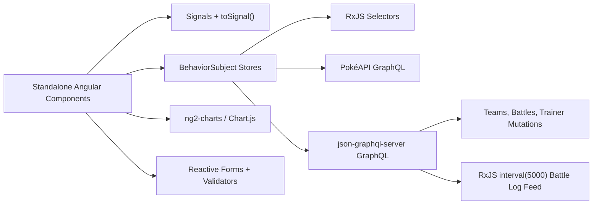
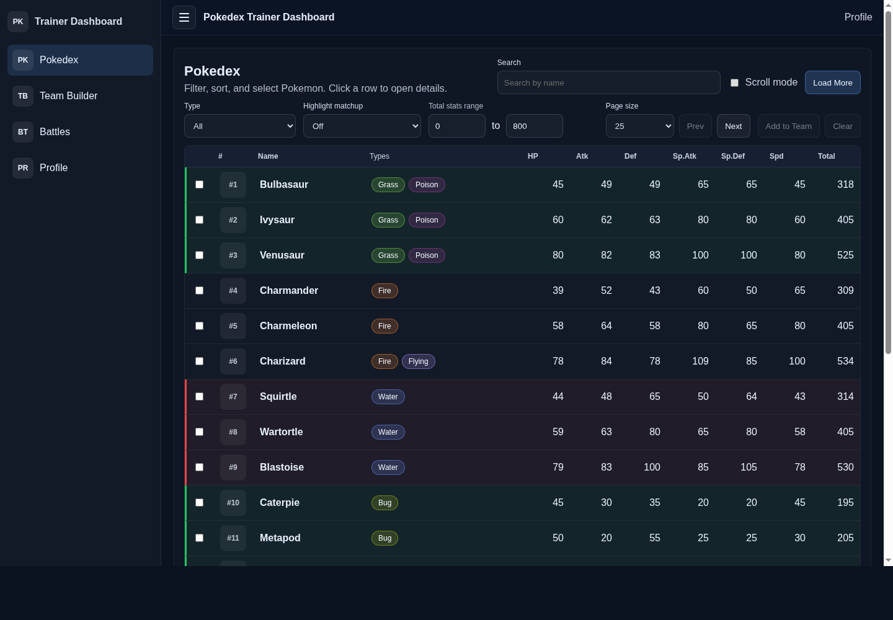
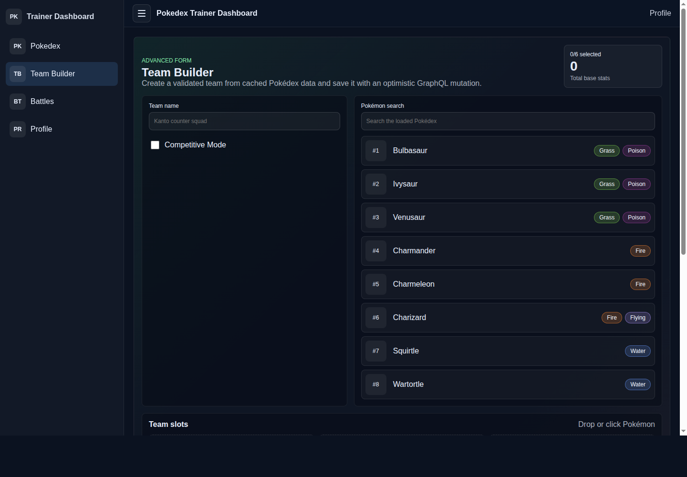

# Pokédex Trainer Dashboard

Single-page Angular 19 dashboard for browsing Pokémon, building trainer teams, logging battles, and editing trainer profiles with GraphQL-backed data.

## Features

- Pokédex table with search, sorting, type/stat filters, pagination, bulk team draft actions, detail drawer, and type matchup highlighting.
- PokéAPI GraphQL integration for Pokémon list/details, abilities, stats, moves, sprites, and type data.
- Local `json-graphql-server` integration for trainers, teams, battles, battle logs, mutations, and polling-based live feed simulation.
- Custom RxJS stores with `BehaviorSubject`, selectors, optimistic team creation, retrying PokéAPI calls, and cleanup through `DestroyRef`.
- Angular Signals for selected Pokémon, tabs/layout state, trainer selection, computed team/battle stats, and persisted trainer preference.
- Advanced Team Builder form with autocomplete, selected chips/slots, `FormArray` member details, async unique-name validation, competitive EV validation, and CDK drag/drop.
- Battle analytics with animated Chart.js/ng2-charts monthly win/loss bar chart.
- Pokémon detail panel with stat radar chart, sanitized YouTube iframe, and cry audio player.

## Architecture



## Screenshots





## Setup

Install dependencies:

```bash
npm install
```

Start the local GraphQL mock server:

```bash
npm run local:graphql
```

In a second terminal, run the Angular dev server:

```bash
npm start
```

Open `http://localhost:4200/`.

## Lower Resource Run Mode

For slower machines, use the static production build instead of `ng serve`:

```bash
npm run build:prod
npm run serve:dist
```

Open `http://localhost:4200/pokedex`.

If you rebuild while `serve:dist` is already running, restart `serve:dist` so it picks up Angular’s new hashed JS filenames.

## Scripts

- `npm run local:graphql` - starts `json-graphql-server db.js --port 4100`
- `npm start` - starts Angular dev server
- `npm run build:prod` - creates optimized production build
- `npm run serve:dist` - serves `dist/pokedex-trainer-dashboard/browser` on port `4200`
- `CHROME_BIN=/snap/bin/chromium npm test -- --watch=false --browsers=ChromeHeadless` - runs unit tests in this environment

## Bonus Tasks Attempted

- Bonus 2: Drag-and-drop Team Builder with `@angular/cdk/drag-drop` for Pokémon suggestions and team slots.
- Bonus 3: Signal-based `[appTypeHighlight]` directive for type effectiveness row highlighting.
- Bonus 5: Micro-interactions including loading spinner, row highlighting, hover states, animated Chart.js updates, and CDK drag previews.

## Test Coverage

The suite includes 9 passing specs covering:

- Store method: seeded Pokémon cache through `PokemonStore.selectPokemonList()`
- Selector: trainer win rate, monthly battle results, and team stats
- Component signal: app sidebar state and nav computed signal
- Form validator: async team name uniqueness and EV budget validation
- Utility: sprite extraction, stat total, and radar stat ordering

## Notes

- The local mock API uses port `4100` because port `4000` may already be occupied in some development environments.
- The simulated subscription uses `interval(5000) + switchMap(...)` polling because `json-graphql-server` does not expose a GraphQL WebSocket subscription transport.
- Initial Pokédex rows are seeded locally so `/pokedex` paints immediately even if the public API or sprite CDN is slow.
