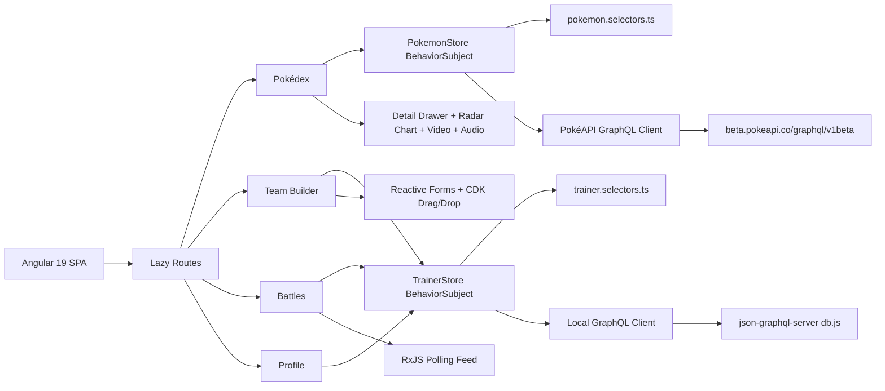

# Pokédex Trainer Dashboard

An Angular 19 single-page application for a Pokémon trainer who needs to browse Pokémon, build teams, track battle results, and manage their trainer profile using GraphQL, RxJS state, Angular Signals, charts, advanced forms, and a polished dashboard UI.

This repository was built for the **Pokédex Trainer Dashboard** client assessment.

## Client Request Notes

The client did not ask for a simple Pokédex page. They asked for a **trainer operations dashboard** that demonstrates modern Angular architecture and practical product workflows.

The core things the client wanted were:

- A **single-page Angular 19 app** with standalone components, OnPush change detection, and modern Angular APIs.
- A **real Pokédex dashboard** where a trainer can browse Pokémon, search/filter/sort rows, view stats, inspect details, and open a detail side panel.
- **GraphQL integration from two sources**:
  - Public PokéAPI GraphQL for Pokémon queries.
  - Local `json-graphql-server` for trainer/team/battle queries and mutations.
- **Query, mutation, and subscription-like behavior**:
  - Public queries for Pokémon lists, details, abilities, moves, stats, sprites, and type relationships.
  - Local queries for trainers, teams, battles, and battle logs.
  - Local mutations for creating/updating/deleting teams, logging battle results, and updating trainer profile.
  - A simulated live battle log feed using RxJS polling because the local mock server does not support real WebSocket GraphQL subscriptions.
- **Custom RxJS state management**, not NgRx/Akita/NgXS:
  - `BehaviorSubject` stores.
  - Derived selectors with `map`, `combineLatest`, `distinctUntilChanged`, and `shareReplay`.
  - Optimistic updates with rollback on mutation failure.
  - Debounced Pokémon search.
  - Retry logic for PokéAPI calls.
  - Cleanup with `DestroyRef` / `takeUntilDestroyed`.
- **Angular Signals** in real UI state:
  - Selected Pokémon.
  - Sidebar state.
  - Current trainer.
  - Loading and UI flags.
  - Computed team and battle stats.
  - Effects for persistence and analytics-style Pokémon view logging.
- **Charts with animation**:
  - Radar chart for Pokémon stats.
  - Bar chart for monthly battle results.
  - Reactive updates when source data changes.
- **Advanced Team Builder form**:
  - Required team name with length validation.
  - Async unique team-name validator.
  - Pokémon autocomplete/search.
  - Up to 6 selected Pokémon.
  - Removable selected Pokémon slots.
  - Per-Pokémon nickname and held item fields.
  - Competitive Mode with tier and EV inputs.
  - EV budget validation.
  - Advisory banner for type coverage gaps.
- **Data table UX**:
  - Type badges.
  - Sortable stat columns.
  - Pagination.
  - Text/type/stat filters.
  - Multi-row select and Add to Team flow.
  - Detail panel on row click.
- **Video/audio in Pokémon detail view**:
  - Sanitized YouTube iframe.
  - Custom play/pause overlay.
  - Pokémon cry audio.
- **At least two bonus tasks**, plus polish:
  - Drag/drop Team Builder.
  - Type effectiveness highlighting directive.
  - Micro-interactions and loading states.
- **Deliverables**:
  - GitHub repository.
  - Clean commit history.
  - README with setup, architecture, screenshots, and bonus task notes.
  - Minimum 5 unit tests.
  - App must build and run without errors.

## What Was Implemented

### Pokédex

- Route: `/pokedex`
- Fast first paint using local seed data for the first 20 Pokémon.
- Table with:
  - Pokémon id/name/types/stats/total.
  - Search.
  - Type filter.
  - Total base-stat range filter.
  - Sort buttons for stat columns.
  - Pagination with page sizes `10`, `25`, and `50`.
  - Multi-select rows.
  - Add selected Pokémon to Team Builder draft.
- Detail drawer route: `/pokedex/:id`
  - Full Pokémon details from PokéAPI GraphQL.
  - Radar stat chart.
  - Moves list.
  - Evolution chain.
  - Sanitized YouTube embed.
  - Pokémon cry audio.

### Team Builder

- Route: `/team-builder`
- Reactive form with:
  - Team name validation.
  - Async duplicate-name validator.
  - Pokémon search/autocomplete from cached store data.
  - Team slots with max 6 Pokémon.
  - Dynamic `FormArray` member forms.
  - Nickname field.
  - Held item dropdown.
  - Competitive Mode toggle.
  - Tier selection.
  - EV spread controls with `510` max total validation.
  - Type coverage advisory.
- Saves teams with optimistic UI update through local GraphQL mutation.
- Uses CDK drag/drop for dragging Pokémon into team slots.

### Battles

- Route: `/battles`
- Battle result form:
  - Opponent name.
  - Team selection.
  - Result.
  - Date.
  - Score.
- Logs new battles through local GraphQL mutation.
- Monthly win/loss Chart.js bar chart.
- Battle history table.
- Simulated real-time battle log feed using `interval(5000) + switchMap(...)`.

### Profile

- Route: `/profile`
- Trainer selector.
- Trainer edit form:
  - Name.
  - Badge count.
  - Region.
  - Avatar URL.
  - Rank.
- Saves trainer profile through local GraphQL mutation.
- Persists selected trainer id in `localStorage`.
- Shows team count and win-rate summary.

## GraphQL Endpoints

### Public Pokémon API

```text
https://beta.pokeapi.co/graphql/v1beta
```

Used for:

- Pokémon list.
- Pokémon details.
- Types.
- Stats.
- Abilities.
- Moves.
- Sprites/artwork.
- Evolution chain.

### Local Mock API

```text
http://localhost:4100/graphql
```

Used for:

- Trainers.
- Teams.
- Battles.
- Battle logs.
- Team mutations.
- Battle mutations.
- Trainer profile mutation.

Important note: the original brief used port `4000`, but this repo defaults to `4100` because `4000` was already occupied during development/testing. The script `npm run local:graphql:4000` is still available if needed.

## Architecture



## File Structure

```text
src/app/
  api/
    models.ts
    pokemon-api.service.ts
    pokemon-seed.ts
    trainer-api.service.ts
  features/
    battles/
    pokedex/
    profile/
    team-builder/
  graphql/
    apollo.providers.ts
    graphql-endpoints.ts
  shared/
    team-draft.service.ts
    type-badge/
    type-colors.ts
    type-highlight.directive.ts
  state/
    pokemon.store.ts
    pokemon.selectors.ts
    trainer.store.ts
    trainer.selectors.ts
```

## Screenshots

### Pokédex


### Team Builder


## Setup

Install dependencies:

```bash
npm install
```

Start the local GraphQL mock server:

```bash
npm run local:graphql
```

In a second terminal, start Angular:

```bash
npm start
```

Open:

```text
http://localhost:4200/
```

## Recommended Low-Resource Run Mode

For slower machines, use a production build and static server instead of `ng serve`.

Terminal 1:

```bash
npm run local:graphql
```

Terminal 2:

```bash
npm run build:prod
npm run serve:dist
```

Open:

```text
http://localhost:4200/pokedex
```

If you rebuild while `serve:dist` is already running, restart `serve:dist`. Angular generates new hashed JavaScript filenames on each production build, and the static server needs a restart to serve the new files.

## Scripts

```bash
npm run local:graphql
```

Starts the local mock GraphQL server on port `4100`.

```bash
npm run local:graphql:4000
```

Starts the same mock server on port `4000`, matching the original brief.

```bash
npm start
```

Starts Angular dev server.

```bash
npm run build:prod
```

Builds the optimized production app.

```bash
npm run serve:dist
```

Serves the production build on port `4200`.

```bash
CHROME_BIN=/snap/bin/chromium npm test -- --watch=false --browsers=ChromeHeadless
```

Runs the unit test suite in this environment.

## Verification Status

Latest local verification:

```text
npm run build:prod
PASS

CHROME_BIN=/snap/bin/chromium npm test -- --watch=false --browsers=ChromeHeadless
9 SUCCESS
```

Manual/browser acceptance QA was also automated with headless Chromium and passed:

```text
26/26 checks passed
```

Checked flows:

- Pokédex renders with seeded data.
- Pokédex search filters rows.
- Pokémon detail panel opens.
- Detail panel shows stats/video/audio sections.
- Type highlight directive applies row highlighting.
- Team Builder renders.
- CDK drop list is present.
- Duplicate team-name validator works.
- Pokémon can be added to team slots.
- Team save mutation creates a local GraphQL team.
- Battles page renders.
- Battle result save mutation creates a local GraphQL battle.
- Profile page renders trainer data.
- Profile save mutation works.
- No app runtime errors were found during the QA pass.

## Unit Tests

The test suite includes coverage for the requested minimum areas:

- Store method:
  - `PokemonStore.selectPokemonList()`
- Selector:
  - `winRate$`
  - `battleResultsPerMonth$`
  - `teamStats$`
- Component signal:
  - `AppComponent.sidebarOpen`
  - `AppComponent.navItems`
- Form validator:
  - Async team-name uniqueness validator.
  - EV budget validator.
- Utility:
  - Sprite URL extraction.
  - Base stat totals.
  - Radar stat ordering.

## Bonus Tasks Attempted

### Bonus 2: Drag-and-Drop Team Builder

Implemented with `@angular/cdk/drag-drop`.

Pokémon suggestions can be dragged into team slots, and selected team cards use CDK drag behavior.

### Bonus 3: Type Effectiveness Matrix Directive

Implemented as:

```html
[appTypeHighlight]="highlightType()"
[appTypeHighlightTarget]="p.types"
```

The directive uses signal inputs and computed state:

- Green border/background for super-effective matchups.
- Red border/background for weak matchups.

### Bonus 5: Micro-Interactions

Implemented:

- Loading spinner.
- Row hover states.
- Type-highlight transitions.
- CDK drag preview/placeholder styling.
- Animated Chart.js updates.
- Polished validation/status banners.

## Important Implementation Notes

### Local GraphQL Mutations

`json-graphql-server` does not use a nested `data` argument for mutations in this generated schema. Mutations must pass fields as top-level arguments.

Example:

```graphql
mutation CreateTeam($trainer_id: ID!, $name: String!, $pokemon_ids: [Int]!, $created_at: String!) {
  createTeam(trainer_id: $trainer_id, name: $name, pokemon_ids: $pokemon_ids, created_at: $created_at) {
    id
    name
  }
}
```

This was verified during QA and fixed in `TrainerApiService`.

### Simulated Subscription

The local mock server does not expose a WebSocket subscription transport. The app simulates live battle logs using:

```ts
interval(5000).pipe(
  startWith(0),
  switchMap(() => this.api.getBattleLogs())
)
```

The store emits only entries newer than the previous poll into the live feed.

### Performance

The initial `/pokedex` route is intentionally lightweight:

- Routes are lazy-loaded.
- Detail panel code is lazy-loaded through child route.
- Pokédex first page uses local seed data.
- Public PokéAPI service is lazy-imported by the store.
- List sprites are not loaded for first paint.

For best performance on lower-resource machines, use:

```bash
npm run build:prod
npm run serve:dist
```

## Pulling on Another Device

```bash
git clone https://github.com/Technova-K02/pokedex-angular.git
cd pokedex-angular
npm install
npm run local:graphql
```

In a second terminal:

```bash
npm run build:prod
npm run serve:dist
```

Open:

```text
http://localhost:4200/pokedex
```

## Troubleshooting

### Page is blank after rebuilding

Restart the static server:

```bash
Ctrl+C
npm run serve:dist
```

Reason: Angular production builds generate new hashed JS filenames, and the static server may still be serving the old file map.

### Local GraphQL server fails to start

Check whether the port is already occupied:

```bash
ss -lptn 'sport = :4100'
```

Use the alternate port script only if you also update `src/app/graphql/graphql-endpoints.ts`:

```bash
npm run local:graphql:4000
```

### Mutations do not save

Confirm the local GraphQL server is running:

```bash
curl -s http://localhost:4100/graphql
```

Also confirm the app is using `http://localhost:4100/graphql` in:

```text
src/app/graphql/graphql-endpoints.ts
```

## Commit Notes

Recent important commits:

```text
fde4b14 fix(api): align local graphql mutations
dd7d70f test: add coverage and assessment docs
6599925 feat(profile): add trainer editor
4539814 feat(battles): add analytics and live feed
b148ee7 feat(team-builder): add advanced team form
8af5ed3 perf: render pokedex from local seed data first
```

## Final Assessment Summary

This app is intended to show that the developer can combine:

- Angular 19 standalone architecture.
- RxJS state management without external state libraries.
- Angular Signals for local UI state and derived values.
- GraphQL query/mutation integration.
- Realistic form validation and optimistic updates.
- Data visualization.
- Dashboard UX.
- Performance awareness.
- Test coverage and QA discipline.
